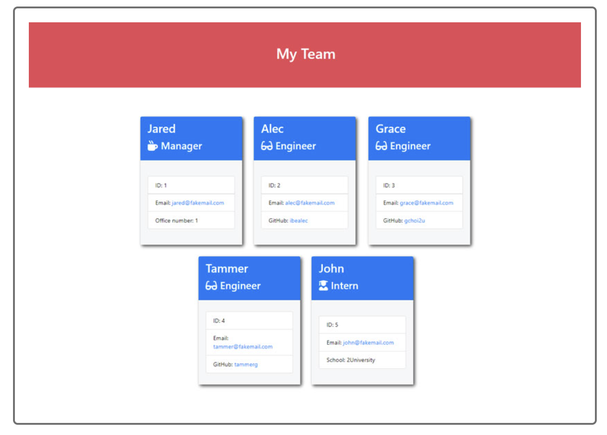

# Team Profile Generator

## License
Eclipse Public License 1.0

## Description: 
The user will be prompt to enter in the Manager's info and given a chance to add either an Engineer or Intern to the team.  After entering all of the team's info, a profile card will be generated for all of the team member.

### Contents
1.  [Installation](#installation)
2.  [Usage](#usage)
3.  [Tests](#tests)

## Installation:  
NPM will be required for this project

## Usage:
This project will use inquirer, boot-strap, font-awesome and jquery

## Tests:
To run this project, type "node index.js" or "node index" at the command prompt (quotation marks are not required)

## Questions:
Github profile:[TCYang1006](https://github.com/TCYang1006)
If there are any additional questions about this project, please contact me at [yangtongchee@hotmail.com](yangtongchee@hotmail.com)